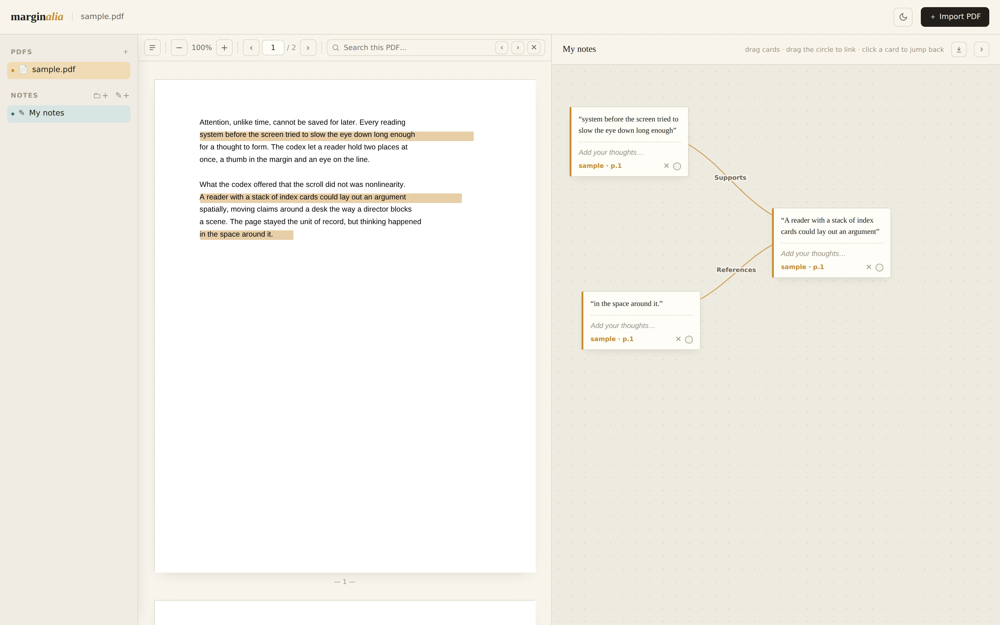

# Marginalia

**[Try it →](https://marginalianotes.app/)** · free, no
account, nothing uploaded · MIT licensed

📝 The story behind it: [I built a PDF reader where every note remembers its page](https://dikshantraj09.hashnode.dev/i-built-a-pdf-reader-where-every-note-remembers-its-page)

[](https://buymeacoffee.com/dikshantraj09)
[](https://github.com/dikshantraj09/marginalia)

<a href="https://www.producthunt.com/products/marginalia-3?embed=true&utm_source=badge-featured&utm_medium=badge&utm_campaign=badge-marginalia-3" target="_blank" rel="noopener noreferrer"></a>



A PDF reader with a freeform notes canvas next to it. Pull excerpts out of
any PDF, write your own notes on them, connect related excerpts with a
thread, and click any card to jump straight back to the exact page it came
from.

Selecting text is a drag-marquee (draw a box over what you want) rather than
the browser's native text selection — this keeps it accurate on tables and
other multi-column layouts, where a PDF's underlying text order often
doesn't match its visual reading order.

PDFs and notes canvases are organized independently, each in their own
folder tree on the left. A canvas isn't tied to one PDF — the same canvas
can hold excerpts pulled from several different PDFs, each card labeled
with (and linked back to) the document it came from. Dark mode is in the
top bar.

### AI-ready export

The export button on a notes canvas downloads one Markdown file. It holds
every card's excerpt, the page it came from, your note on it, and each link
in both directions, plus a short header that explains the format. Give that
file to ChatGPT, Claude or any other assistant together with the source PDF
and ask it to summarize your argument, find where your notes disagree, or
quiz you.

**Copy for AI** (next to the export button) skips the file: it puts the same
map on your clipboard with a ready-made prompt in front, ready to paste into
a chat. Image excerpts are embedded in the downloaded file and referenced by
page in the copied version.

## Running it

This is a static site (no backend, no build step) — but it uses ES modules,
which browsers refuse to load from `file://`, so it needs to be served over
HTTP. From this folder:

```
python3 -m http.server 8080
# or: npx serve .
```

Then open `http://localhost:8080`.

## How it works

- **PDF.js** (vendored in `vendor/pdfjs/`, no CDN needed) renders pages and
  provides the selectable text layer.
- **IndexedDB** stores your PDFs and notes locally in the browser — nothing
  leaves your machine, no server, no account.
- **Installable as a PWA** — `app/manifest.webmanifest` + `app/service-worker.js`
  cache the app shell (HTML/CSS/JS/PDF.js) for offline use once installed.
  Chrome/Edge/Android show an install icon in the top bar when the browser
  decides the page qualifies; on iOS/Safari, use Share → Add to Home
  Screen. There's nothing to fetch or sync once installed — it's the same
  local-only IndexedDB storage either way.
- Everything is plain HTML/CSS/JS — no build step, no framework, no
  dependencies to install to run it (PDF.js is only needed if you want to
  re-vendor a newer version; see `package.json`).

## Project structure

```
index.html            the app shell
manifest.webmanifest   PWA manifest (name, icons, standalone display)
service-worker.js      caches the app shell for offline / installed use
icons/                 generated PWA/favicon icons
css/styles.css         all styles (light + dark)
js/
  app.js               wires everything together
  db.js                 IndexedDB wrapper (folders, documents, cards, links)
  rail.js               folder tree — PDFs + paired Notes
  pdfview.js             renders PDF pages, text selection, highlights
  canvas.js              the freeform notes canvas — cards, links, drag
  modal.js               in-page prompt/confirm/alert (no native dialogs)
  vault.js               password/lock support for private PDFs
  tour.js                first-run guided walkthrough, replayable from "?"
vendor/pdfjs/           vendored PDF.js build (offline, no CDN dependency)
```

## What's not in this first pass

Cloud sync across devices and PDF markup/drawing tools.

## Support Marginalia ☕

Marginalia is free forever: no ads, no account, no tracking. It's built by one
person in their spare time. If it saved you an evening of hunting for "which
page was that on?", a coffee keeps it going: hosting, the domain, and time for
what's next (encrypted sync, ask-your-notes AI, a web clipper).

<a href="https://buymeacoffee.com/dikshantraj09"></a>

Can't chip in? A ⭐ on this repo helps just as much. It's how other readers find it.

## License

[MIT](LICENSE) © 2026 Dikshant Raj.

The vendored PDF.js build in `app/vendor/pdfjs/` is © Mozilla and
contributors, licensed under the Apache License 2.0 (see the notice at the
top of each file).
